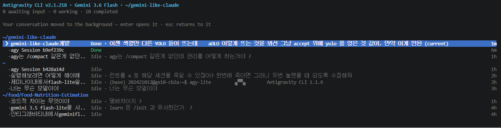

# Gemini Agent View (`gemini-agent-view`)

> **Non-invasive PTY wrapper for Google Antigravity (AGY) & Gemini CLI — preserving the native terminal experience 100% intact while adding Claude Code 1:1 Agent View & Background Session Management.**

---

## Architecture Philosophy

* **Native Terminal Experience Intact**: Unlike full UI rewrites, `gemini-agent-view` runs as a lightweight PTY proxy wrapper. Your existing Gemini / Antigravity CLI terminal interface, prompts, model behavior, and native commands remain 100% unchanged.
* **Seamless Agent View Overlay**: Adds a powerful Claude Code-style Agent View TUI overlay that stays out of your way until triggered (`←` `←` double-tap or `Ctrl+←`).

---

## Key Features

* **Claude Code 1:1 Agent View (TUI)**: Folder-grouped workspace tree view for managing multiple parallel background sessions.
* **Double-Tap Navigation (`←` `←`)**: Double-tap Left Arrow within 0.6s at an empty prompt to immediately open Agent View.
* **Default YOLO Mode**: Runs in `--dangerously-skip-permissions` by default for fast, uninterrupted tool approvals and automated workflow execution.
* **Minimalist Gemini Theme**: Clean header layout without clutter and custom session renaming support via `/rename <name>`.
* **Background Task Persistence**: Sessions continue executing tools and generating responses in background PTYs with real-time `Running` / `Done` status tracking.
* **Empty Prompt Protection**: Double-tap and `Ctrl+Left` navigation work only when the input prompt is completely empty, ensuring uninterrupted text navigation while typing.

---

## Quick Start

```bash
# Clone repository
git clone https://github.com/leehogwang/gemini-agent-view.git
cd gemini-agent-view

# Install dependencies & build
npm install
npm run build
```

---

## Shortcuts & Controls

| Shortcut | Description |
|---|---|
| `←` `←` (Double-Tap) | Open Agent View (when input prompt is empty) |
| `Ctrl + ←` | Open Agent View |
| `Shift + Tab` | Toggle underlying agent mode |
| `↑` / `↓` | Navigate sessions in Agent View |
| `Enter` | Attach / Switch to selected session |
| `Esc` | Return to origin session |
| `n` / `Ctrl+N` | Start a new session |
| `x` / `Ctrl+X` | Terminate selected session |

---

## License

MIT License.
